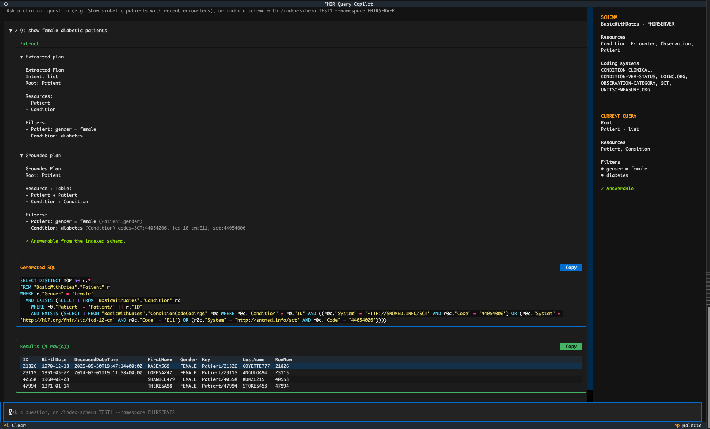

# FHIR Query Copilot

This repository is an entry for the [InterSystems Programming Contest: AI Agents + FHIR](https://community.intersystems.com/post/intersystems-programming-contest-ai-agents-fhir).

It implements one of the suggested tasks directly:
**Natural Language to FHIR Query Explorer**.

The project lets users explore FHIR data conversationally by translating clinical questions into transparent, executable SQL over InterSystems IRIS for Health FHIR SQL Builder projections.

Unlike a typical NL-to-SQL demo, this project does not let the model generate arbitrary SQL directly. The flow is:

`natural language -> structured query plan -> schema grounding -> deterministic SQL generation -> execution`

That makes the system easier to inspect, explain, and debug.


*FHIR Query Copilot showing the extracted query plan, schema grounding, generated SQL, and execution results for a natural language question.*

## What You Should Know

- This is a conversational query explorer for FHIR data on InterSystems IRIS for Health.
- It works against a FHIR SQL Builder projection.
- It shows the extracted intent, grounded plan, generated SQL, and final results.
- It supports clarification and follow-up refinement instead of treating every query as an isolated prompt.
- If the projection is missing required fields, it can explain what is missing and suggest what should be projected.

## Example Conversation

```text
User: Show diabetic patients
System: Found matching patients

User: Only females
System: Refined the existing query

User: Born after 1950
System: Refined the existing query again

User: Count them
System: Returns the count for the refined cohort
```

This stateful refinement is one of the main differentiators of the project. The conversation updates a shared query plan instead of restarting from scratch on every turn.


*Multi-turn query refinement. Each user message updates the existing SQL query plan instead of starting a new session.*

## Projection Recommendations

FHIR Query Copilot does not simply fail when a question cannot be answered from the current FHIR SQL Builder projection.

Instead, it identifies the missing resources or fields and recommends what should be projected.

Example:

Question:

> Show diabetic patients that are alive

Response:

> I can't fully answer that from the indexed schema

Missing: (concept 'admission' is not in the coding dictionary; time window 'recent' has no date field in the schema)

Extend your FHIR projection with:
- Encounter.period.start — Needed to filter encounters to those admitted/relevant within the last 30 days (the start of the encounter).

Re-index after extending the projection, or rephrase the question.


*Projection recommendations help users understand why a question cannot be answered and which FHIR fields should be added to the projection.*

## Quick Demo

### Prerequisites

- Docker
- Python 3.12
- [`uv`](https://docs.astral.sh/uv/)
- An OpenAI API key

### 1. Clone and configure

```bash
git clone https://github.com/blockpass253/iris-health-fhir-query-explorer.git
cd iris-health-fhir-query-explorer
cp .env.example .env
```

Edit `.env` and set at least:

```bash
OPENAI_API_KEY=your_key_here
```

The default IRIS connection settings already point to the included demo container.

### 2. Start the demo IRIS instance

```bash
make iris-up
```

This starts the prebuilt IRIS for Health demo image defined in [`compose.yaml`](./compose.yaml).

### 3. Install dependencies

```bash
make install
```

### 4. Verify IRIS connectivity

```bash
make run
```

This runs a simple `SELECT $ZVERSION` smoke test.

### 5. Index the FHIR SQL Builder projection

```bash
uv run iris index-schema MEDICATIONS --namespace FHIRSERVER
```

This builds the local semantic registry used at runtime and writes it to `data/schema_registry.json`.

The demo image ships with three projections (see [Available projections](#available-projections)):

| Projection | Resources | Notes |
| --- | --- | --- |
| `BASIC` | Patient, Encounter, Observation, Condition | Minimal fields only |
| `BASICWITHDATES` | Patient, Encounter, Observation, Condition | Includes dates and other useful fields |
| `MEDICATIONS` | Patient, Encounter, Observation, Condition, MedicationRequest | Same as BasicWithDates plus medications |

Use `MEDICATIONS` for the fullest demo experience. Use `BASIC` if you only want to verify connectivity.

### 6. Launch the interactive demo

```bash
make tui
```

Then ask questions such as:

- `Show diabetic patients`
- `Only the ones over 65`
- `Count them`
- `Show A1c observations from the last year`
- `Top 5 medications prescribed in the last 6 months`

## Why This Fits The Suggested Task

The contest suggested building a natural-language FHIR query experience. This project does that by putting a conversational layer on top of FHIR SQL Builder.

The key point is that the app is not just translating text into SQL. It is:

- identifying the intended FHIR resources
- grounding clinical concepts against the available schema
- adapting to the actual projected tables and fields
- asking for clarification when needed
- generating SQL deterministically
- executing the query and showing the reasoning

## Why This Is Not Just NL -> SQL

Traditional NL -> SQL systems often assume:

- fixed schemas
- fixed table names
- direct SQL generation from the prompt

FHIR Query Copilot instead:

1. Builds a structured FHIR query plan.
2. Grounds that plan against the available projection.
3. Adapts to projection-specific table and field names.
4. Generates SQL deterministically.
5. Supports clarification and conversational refinement.

The model never generates SQL directly.

## What Makes This Different

### Transparent by design

The system does not behave like a black box. Users can see:

- what the model extracted from the question
- how that was mapped to the available projection
- what SQL was generated
- what results came back

### Schema-adaptive

FHIR SQL Builder projections are customizable. Table names, available resources, and fields can differ between environments. This project does not rely on a fixed handcrafted SQL template per question. It first indexes the actual projection and then binds queries against that indexed registry.

### Deterministic SQL generation

The LLM helps with semantic interpretation and schema binding, but SQL generation itself is deterministic. That reduces hallucination risk and makes failures easier to understand.

### Conversational refinement

In the TUI, users can refine a previous question naturally, for example:

```text
Show diabetic patients
Only females
Born after 1950
Count them
```

### Human-in-the-loop query generation

The system does not silently guess when a query is ambiguous.

If multiple resources or fields could satisfy a request, FHIR Query Copilot asks the user for clarification before generating SQL.

This keeps query generation transparent and allows users to remain in control of the final query.

### Multiple root resources

This is not limited to patient cohort queries. The runtime can anchor the query on different FHIR root resources depending on what the user is asking for, including:

- `Patient`
- `Condition`
- `Observation`
- `Encounter`
- `MedicationRequest`

Examples:

- `Show diabetic patients` -> root resource `Patient`
- `Show active conditions` -> root resource `Condition`
- `Show A1c observations from the last year` -> root resource `Observation`
- `Show recent encounters` -> root resource `Encounter`
- `Top 5 medications prescribed in the last 6 months` -> root resource `MedicationRequest`

### Projection feedback

If the current projection cannot answer a question, the app can explain why and suggest which FHIR fields or resources should be added.

For example, a question like:

```text
Show diabetic patients with A1c above 9 in the last year
```

may fail if the projection can ground the A1c value filter but has no projected date field for the Observation time window. In that case, FHIR Query Copilot treats the query as not answerable from the current schema and can suggest projection additions such as:

- `Observation.effectiveDateTime`
- `Observation.issued`

The goal is not to guess. The system stops, explains the gap, and makes the missing projection actionable.

## Runtime Flow

The current runtime pipeline is:

1. Index a FHIR SQL Builder projection into a semantic registry.
2. Extract a structured query plan from natural language.
3. Bind that plan to the indexed schema.
4. Ask for clarification if the request is ambiguous.
5. Generate deterministic IRIS SQL.
6. Execute the query and render the results.

## Current Scope

The demo is currently strongest at:

- patient cohort discovery
- count queries
- top-N aggregate questions
- relative time windows such as "last 6 months"
- concept-driven filters driven by the coding dictionary built from the indexed projection (diabetes, A1c, medications, and whatever terminologies your projection contains)
- multi-turn refinement in the TUI

Current limitations:

- no general-purpose arbitrary SQL generation
- no broad projection of columns from related resources
- no attempt to support every possible FHIR search pattern
- behavior is intentionally narrower than full SQL in exchange for transparency and reliability

## Detailed Setup

### Environment variables

Connection settings are loaded from `.env` or the shell environment:

| Variable | Default | Description |
| --- | --- | --- |
| `IRIS_HOST` | `localhost` | IRIS hostname |
| `IRIS_PORT` | `1972` | IRIS superserver port |
| `IRIS_NAMESPACE` | `FHIRSERVER` | Namespace to connect to |
| `IRIS_USERNAME` | `_SYSTEM` | Username |
| `IRIS_PASSWORD` | `SYS` | Password |

LLM settings:

| Variable | Default | Description |
| --- | --- | --- |
| `OPENAI_API_KEY` | unset | Required for extraction and binding |
| `OPENAI_MODEL` | `gpt-5.4-nano` | Model override |

### Available commands

| Command | Purpose |
| --- | --- |
| `make iris-up` | Start the demo IRIS container |
| `make iris-down` | Stop the demo container |
| `make iris-logs` | Show IRIS container logs |
| `make install` | Install Python dependencies |
| `make run` | IRIS connectivity smoke test |
| `make tui` | Launch the interactive Textual UI |
| `uv run iris index-schema <PROJECTION>` | Build the semantic registry for a projection |
| `uv run iris query "<question>"` | Run a one-shot query from the CLI |

### Available projections

The Docker image is a prebuilt IRIS snapshot that ships with three FHIR SQL Builder projections in the `FHIRSERVER` namespace:

| Projection | Resources | Description |
| --- | --- | --- |
| `BASIC` | Patient, Encounter, Observation, Condition | A minimal projection with a small set of fields. Good for verifying connectivity. |
| `BASICWITHDATES` | Patient, Encounter, Observation, Condition | Extends `BASIC` with date fields (e.g. `effectiveDateTime`, `period.start`) and other useful attributes. Enables time-window queries. |
| `MEDICATIONS` | Patient, Encounter, Observation, Condition, MedicationRequest | Everything in `BASICWITHDATES` plus the `MedicationRequest` resource. Enables medication queries such as "top 5 medications prescribed in the last 6 months". |

Run `uv run iris index-schema <PROJECTION> --namespace FHIRSERVER` to build the registry for the projection you want to use.

### Notes about the demo image

This repository focuses on the query-exploration layer:

- schema indexing
- semantic query planning
- grounding
- deterministic SQL generation
- interactive exploration

## Technology Stack

- InterSystems IRIS for Health
- FHIR Server
- FHIR SQL Builder
- Python 3.12
- OpenAI API
- LangGraph
- Typer
- Textual
- Docker

## Repository Goal

The goal of this project is to make FHIR SQL Builder more accessible for analysts, developers, and data consumers who want to explore healthcare data without manually writing SQL or knowing every detail of the projected schema.
